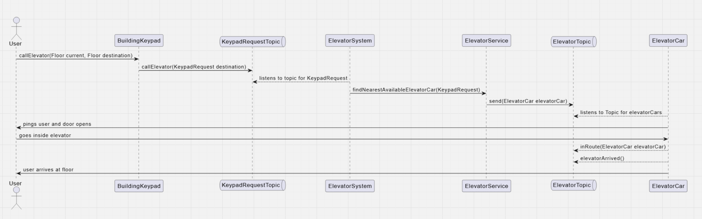
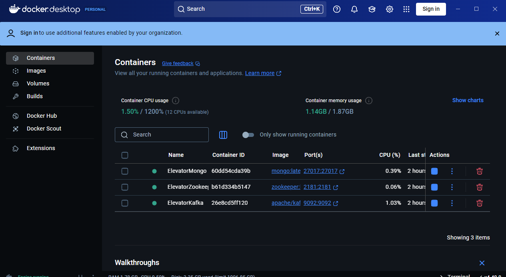
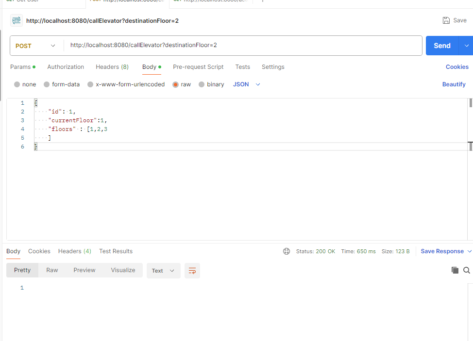
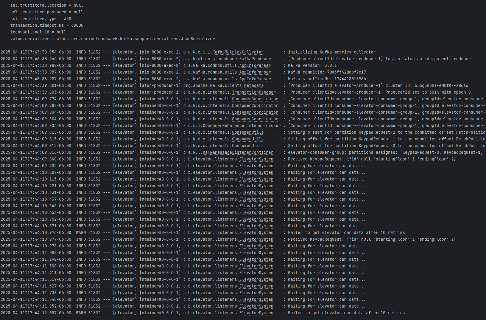
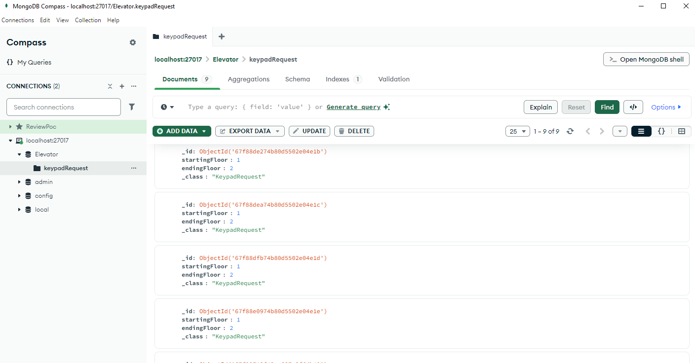

## Smart Elevator Project

A Java-based elevator system using Spring Boot, MongoDB, and Kafka. This is using Java 17 and gradle.

### Overview

This project implements a smart elevator system with features inspired by a system I encountered in a previous job.
Instead of selecting a destination floor *inside* the elevator, users specify their desired floor *before* entering. The
system then dispatches the nearest available elevator to efficiently transport the user. This project was undertaken as
a personal challenge to implement an elevator system using an event-driven architecture. The following sections detail
the design decisions, setup, and areas for potential improvement.

### Tech Stack Decisions

#### MongoDB

MongoDB was chosen for its ability to handle the complex, nested data relationships inherent in an elevator system (
e.g., elevator status, floor access permissions for keypads). While PostgreSQL or MySQL could have been used with
appropriate indexing, MongoDB's document-oriented approach simplified the representation of these relationships.

#### Netflix DGS

Although perhaps an ambitious choice for this project, Netflix DGS was used to automatically generate entities, clients,
and types from a defined schema. This approach would facilitate the future development of a GraphQL endpoint, enabling
other teams to easily query elevator system data.

#### Kafka / Event-Driven Architecture

Kafka's queue-based architecture was selected to support simultaneous requests from multiple users on different floors.
This event-driven approach allows for asynchronous processing of elevator requests, improving system responsiveness and
scalability.

### Planning

I decided to a do uml doc using PlantUML to write out my architecture before coding.



The final implementation required some adjustments to the original design. For example, the initial design used a single
Kafka topic, but the design evolved to use multiple topics. The diagram does not explicitly show the interactions
between the topics and the MongoDB database for querying and status updates, to maintain clarity.

### Setup

The following docker containers (and images) are required to set up and run the project:

* mongo
* zookeeper
* apache/kafka.



There is also a custom plugin/script under the intellij gradle sidebar Tasks->dgs graphql codegen -> generateJava.

After doing a gradle clean build its as simple as just running the application as a spring boot project. The way its
configured we don't need to create custom topics via commands in our kafka instance (although I'm not going to lie, I
definitely did at the start).

### Usage Walkthrough

A Postman collection (located in `test/resources` of the project) is provided to send requests to call the elevator. The
destination floor is included as a parameter, and the starting location (keypad information) is included in the JSON
body of the request.



Keypads are designed to store information about the floors they can access. This allows for customization of floor
access rights for each keypad.

After the application is running, sending a request will produce output in the Spring Boot console similar to the
following:



Keypad requests are stored in the local Docker MongoDB database. This can be verified using a tool such as MongoDB
Compass:



### Docker Testing

The project includes Docker support for running tests in an isolated environment:

### Prerequisites
- Docker installed on your system

### Running Tests in Docker
```bash
docker-compose up --build
```

This will:
1. Build a Docker image with Java 17 and all dependencies
2. Run all tests in an isolated container
3. Output the test results

### Docker Files
- `Dockerfile`: Configures the test environment with Gradle and Java 17
- `docker-compose.yml`: Defines the test service configuration

### Configuration Details
The Docker setup:
- Uses the official Gradle 7.6.1 image with Java 17
- Automatically copies all source files
- Runs the Gradle test task
- Cleans up after completion

### Retrospective

#### Good

* The project scope was challenging and engaging, providing an opportunity to improve proficiency in several
  technologies.
* The project provided valuable hands-on experience in both architectural planning and implementation.
* The system is designed to be scalable.
* Netflix DGS simplifies potential collaboration with other teams by enabling the creation of custom data fetcher
  templates to interact with the MongoDB database.

#### Bad

* The project took longer to complete than the initial estimate of 2-3 days (actual time: 5 days).
* The codebase could be cleaner.
* Serialization/deserialization and Kafka configuration were challenging.
* The assignment is not fully complete.
* Handling multiple Kafka topics within a single codebase introduced complexity in Gson deserialization.
* The project lacks a user interface.
* The ElevatorSystem is not fully unit/integration tested.

#### What I would do differently

* Create `docker-compose.yml` scripts to simplify project setup.
* Reconsider the use of Netflix DGS to reduce project complexity and development time.
* Prioritize code cleanup.
* Adopt a more rigorous test-driven development (TDD) approach.
* Invest more time in developing comprehensive Kafka-related tests, potentially using a Behavior-Driven Development (
  BDD) framework like Gherkin.

#### Conclusion

Hopefully this can prove that I'm not just an ai bot that's trying to get past a coding interview/project, and that I am
capable of being able to develop a complex system from scratch. I definitely have a lot to learn, but that's the fun
part of life!

For
transparency I did use SOME ai for the project, but mainly for knowledge and some test setup lines.  (Also it gets
things wrong. Like a LOT.)  Also to edit the readme so it would sound more impressive and confident. Hopefully that's
ok. I might contrinue working on this project later, I feel like its a really good portfolio piece!